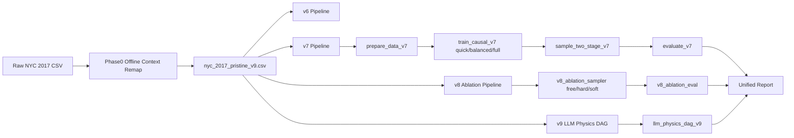
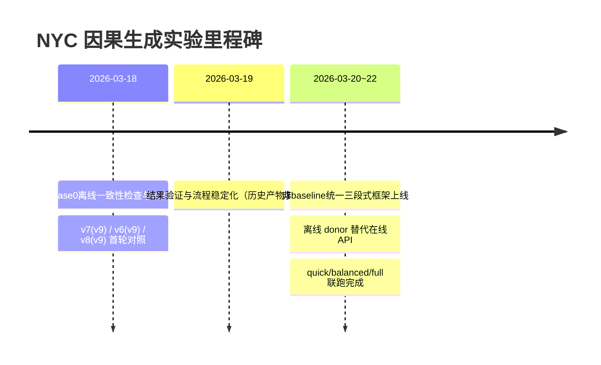

**日期**: 2026-03-22
**文档目的**: 系统梳理项目实验框架（历史演进 + 本周进展），沉淀可复现实验路径与当前最优实践。

## 1. 实验框架总览（历史到当前）

### 1.1 研究主线
本项目围绕 NYC 2017 交通事故数据的因果生成建模，形成了从 `v6 -> v7 -> v8 -> v9` 的持续迭代路径：
- `v6`: 经典因果 DDPM 路线，强调可运行基线与任务效用。
- `v7`: Two-Stage（先锚点后条件生成），强调“上下文先行 + 逻辑一致性”。
- `v8`: 神经符号与规则/LLM先验融合，强调可解释与约束控制（free/hard/soft）。
- `v9`: 离线上下文重建与一致性校验，强调可复现与数据口径统一。

### 1.2 端到端流程图（图1）

图1解释:
- Phase0 先统一离线上下文，输出 `v9` 数据。
- v7/v8/v9 三条非 baseline 路径并行。
- 当前统一汇总出口为 `exp/nonbaseline_suite_v9/nonbaseline_unified_report.md`。

## 2. 历史阶段性成果回顾

### 2.1 关键里程碑时间线（图2）

### 2.2 2026-03-18 已验证结论（来自历史日志）
- `exp/phase0/offline_consistency_report_v9.json`
  - `overall_discrepancy_rate = 0.4772`（高于阈值 0.35，但通过 `--force_overwrite` 产出 `nyc_2017_pristine_v9.csv`）
- `exp/nyc_crash_v7/causal_m4_v7_v9/eval_v7_v9.json`
  - `logic_violation_rate = 0.0`
  - `numeric_drift_avg = 0.4701`, `categorical_tv_avg = 0.0644`
- `exp/nyc_crash_v3/causal_m4_v6_v9/evaluation_report.json`
  - `avg_js_divergence = 0.0168`
  - `task2_primary_cause test_macro_f1 = 0.743`
  - `task3_is_injury test_auc = 0.7036`

## 3. 本周（近7天）核心改进与价值

### 3.1 工程化改进
- 新增统一三段式非 baseline 框架:
  - `scripts/nonbaseline_train.py`
  - `scripts/nonbaseline_evaluate.py`
  - `scripts/nonbaseline_output.py`
  - `scripts/run_nonbaseline_suite.py`
- 统一入口一键执行 `train -> evaluate -> output`，并支持 `quick/balanced/full` 三档。

### 3.2 稳定性改进
- 修复 `lib/data.py` 的 `np.isnan` 类型崩溃路径:
  - 对 `X_num` 强制数值化（`pd.to_numeric(errors='coerce')`）。
- 消除 v8 在线依赖不稳定因素:
  - `v8_ablation_sampler.py` 默认使用 `weather_source=donor`, `osm_source=donor`。
  - 即便传入 `api` 也会重定向为离线路径，规避 429 和年份口径不一致风险。

### 3.3 可复现性改进
- 统一产物索引文件:
  - `exp/nonbaseline_suite_v9/train_state.json`
  - `exp/nonbaseline_suite_v9/eval_state.json`
- 报告文件稳定输出:
  - `exp/nonbaseline_suite_v9/nonbaseline_unified_report.md`

## 4. 本周结果汇总（v9, 非baseline）

### 4.1 v7 三档对比（图3：表格）
| Profile | rows_syn | logic_violation_rate | numeric_drift_avg | categorical_tv_avg | avg_sparse_fidelity_ratio |
|---|---:|---:|---:|---:|---:|
| quick | 20,000 | 0.0000 | 0.3225 | 0.3175 | 0.8534 |
| balanced | 80,000 | 0.0000 | 0.0483 | 0.0045 | 0.8533 |
| full | 159,992 | 0.0000 | 0.0475 | 0.0027 | 0.8551 |

图3解释:
- v7 在 `balanced/full` 的分布保真（drift/TV）显著优于 `quick`。
- 三档逻辑一致性均保持 `0` 违规。
- fidelity ratio 整体稳定在 `0.85` 左右，`full` 略优。

### 4.2 v8 三档 x 三模式对比（图4：表格）
| Profile | Mode | Logic Violation | Commonsense Violation | Correction Rate | TSTR_F1_Macro |
|---|---|---:|---:|---:|---:|
| quick | free | 0.000300 | 0.000250 | 0.000000 | 0.104875 |
| quick | hard | 0.000000 | 0.000000 | 0.000300 | 0.107754 |
| quick | soft | 0.000000 | 0.000000 | 0.000600 | 0.049500 |
| balanced | free | 0.000450 | 0.000162 | 0.000000 | 0.179664 |
| balanced | hard | 0.000000 | 0.000000 | 0.000450 | 0.183815 |
| balanced | soft | 0.000000 | 0.000000 | 0.000600 | 0.115711 |
| full | free | 0.000406 | 0.000156 | 0.000000 | 0.186457 |
| full | hard | 0.000000 | 0.000000 | 0.000406 | 0.182579 |
| full | soft | 0.000000 | 0.000000 | 0.000463 | 0.094119 |

图4解释:
- `hard` 模式在逻辑/常识违规率最稳（均归零）。
- `free` 在 full 档任务效用（TSTR_F1）最高。
- `soft` 在当前规则惩罚主导配置下，效用尚未超过 `hard/free`。

## 5. 当前实验结论（可写入阶段报告）
- 结论1: 离线 donor 路径已经可稳定替代在线 API，复现性和执行稳定性显著提升。
- 结论2: v7 的推荐训练档位是 `balanced`（成本与效果平衡）或 `full`（上限略优）。
- 结论3: v8 当前推荐 `hard` 作为稳健默认；若追求效用上限，可并行保留 `free` 作对照。
- 结论4: v9 LLM DAG 路径已接入统一框架，当前产物可复现（本轮使用 `mock` 模式）。

## 6. 本周产物索引（便于追溯）
- 历史日志:
  - `Experiment_Logs/2026-03-18.md`
  - `Experiment_Logs/2026-03-22.md`
- 本周框架与结果:
  - `exp/nonbaseline_suite_v9/train_state.json`
  - `exp/nonbaseline_suite_v9/eval_state.json`
  - `exp/nonbaseline_suite_v9/nonbaseline_unified_report.md`
  - `exp/nonbaseline_suite_v9/v9_llm/physics_dag_v9.json`
- 数据一致性:
  - `exp/phase0/offline_consistency_report_v9.json`

## 7. 下周计划（可执行）
- 统一 v6/v7/v8 跨方法指标口径，输出单一总表（逻辑一致性 + 分布保真 + 下游效用）。
- 提升 v8 soft 的离线 commonsense 打分质量（替代当前弱规则惩罚），验证是否能超过 hard/free。
- 增加多 seed 汇总（均值/方差/置信区间），降低单次训练波动对结论的影响。

## 8. 参考历史日志后的补充总结（v4/v5/v6/v7）

### 8.1 从早期训练问题到当前稳定框架的演进逻辑
- 早期（`EXPERIMENT_LOG.md`）主要问题是“可训练但不可用”：
  - 训练可收敛，但采样阶段出现数值发散，导致下游任务失真。
  - 时间特征缺失、二元标签被当连续值处理，导致分布与语义偏移。
- 中期（`EXPERIMENT_LOG_v6.md`）完成“目标变量建模范式修复”：
  - 将 `y` 从高斯扩散路径迁移为分类扩散（catY），显著修复零膨胀计数目标分布。
  - 在 D1/D2 多项指标实现对 TVAE/CTGAN 的系统性优势。
- 当前（`2026-03-22_实验框架梳理与周报.md`）完成“工程化与复现化闭环”：
  - 统一三段式非 baseline 入口。
  - 默认离线 donor 路径，削弱在线 API 抖动。
  - 形成可追溯状态文件与统一报告出口。

### 8.2 历史经验对本周决策的直接支撑
- 决策A（默认 offline donor）来自历史在线依赖风险：
  - 历史运行多次出现 API 不稳定、速率限制和年份口径偏差风险。
  - 因此本周将 `v8_ablation_sampler.py` 的上下文来源固定为离线优先。
- 决策B（profile 分层）来自历史 quick/balanced/full 差异：
  - quick 适合验证链路，balanced/full 才能稳定体现分布保真和任务效用。
  - 本周统一脚本沿用此分层，避免“单档结论外推”偏差。
- 决策C（强调逻辑一致性 + 分布 + 下游效用三维）来自 v6/v7 日志实践：
  - 单看 loss 容易掩盖真实质量；必须联合 `logic_violation`、drift/TV、TSTR 指标。

### 8.3 重要技术债与边界条件（补充说明）
- `exp/phase0/offline_consistency_report_v9.json` 中 discrepancy 仍偏高（0.4772），当前通过 `--force_overwrite` 完成产物落地。
- 这意味着 v9 数据可用于流程联调与对比，但在“最终结论报告”中需明确标注该边界，避免过度解释。
- v9 的 LLM DAG 当前为 `mock` 路径，现阶段结论属于“接口与流程可复现”，不等价于“在线知识增强效果已验证”。

## 9. 与项目设计文档的映射补充（baseline_experiment）

### 9.1 设计分层对照
基于 `baseline_experiment/README.md` 的 A-E 模块设计，可与当前主线形成如下映射：

| 设计模块 | baseline_experiment 定义 | 当前主线对应实现 | 当前状态 |
|---|---|---|---|
| A 数据准备 | `00_Data_Preparation` | `prepare_data_v7.py` + Phase0 offline remap | 已工程化并纳入统一入口 |
| B 基线训练 | `01_Baseline` | v6/v7/v8 非 baseline 训练脚本 | 并行存在，侧重点不同 |
| C 特征/机制消融 | `02_Feature_Ablation` | `v8` free/hard/soft + 历史 `ablation_v3.py` | 已形成可执行对照框架 |
| D 评估对比 | `03_Evaluation` | `evaluate_v7.py` + `v8_ablation_eval.py` + unified output | 已统一报告出口 |
| E 结果归档 | README 中结果目录规范 | `exp/nonbaseline_suite_v9/*_state.json` + unified report | 已完成 |

### 9.2 设计一致性结论
- 一致性1：模块化分层思想保持一致。
  - 当前非 baseline 三段式脚本与 baseline 项目结构在职责划分上同构。
- 一致性2：评估导向一致。
  - 均强调从“单点指标”转向“组合指标 + 对照实验”。
- 一致性3：可复现导向增强。
  - 当前新增状态文件（`train_state.json`/`eval_state.json`）比早期日志式记录更适合自动化追踪。

### 9.3 建议纳入统一规范（可直接执行）
- 规范1：建立统一指标 schema（建议 JSON 字段标准化）
  - 核心字段建议固定为：`logic`, `distribution`, `utility`, `privacy`, `consistency`。
- 规范2：统一 profile 命名和预算标注
  - 在所有报告中固定记录 `steps/rows_syn/runtime/device/seed`。
- 规范3：统一实验签名
  - 建议新增 `experiment_signature`（数据版本 + 代码版本 + 配置哈希）以支持跨周复盘。

## 10. 可直接复用的阶段结论（补充版）
- 阶段结论A（工程）：当前框架已从“脚本集合”升级为“可编排流程”，复现实验成本显著下降。
- 阶段结论B（方法）：v7 在逻辑一致性与分布稳定性上表现稳健；v8 `hard/free` 分别对应稳健性与效用上限。
- 阶段结论C（数据）：v9 路径已打通，但一致性报告提示仍需持续降低 discrepancy，才能进入严格结论阶段。
- 阶段结论D（管理）：历史日志、状态文件、统一报告三者已具备闭环，可支撑后续论文/汇报的证据链追踪。
