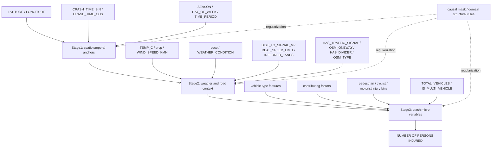

# 2026-05-08 实验日志

## no-H3 阶段性方法论与结果总结

### 总结范围

本日志只总结当前无 H3 road-cell 的主线结果与方法论，不把 `ROAD_H3_CELL` 机制纳入当前主结论。H3 r8 仍保留为后续机制实验方向，但当前论文叙事先围绕：

```text
our_model_no_h3
```

展开。

当前主模型实现侧历史 experiment id 为：

```text
ours_stage2_causal
```

论文/结果侧推荐命名为：

```text
our_model_no_h3_full
```

### 方法论主线

当前方法可概括为：

```text
Causal hierarchical crash generation without H3 road-cell
```

核心思想是把交通事故表格生成拆成三个具有因果含义的层级：

```text
Stage1: spatiotemporal anchors
    -> Stage2: weather and road context
        -> Stage3: crash micro-variables and injury outcome
```

其中：

- Stage1 生成事故发生的外生时空锚点。
- Stage2 在时空条件下补全天气与道路上下文。
- Stage3 在时空和上下文条件下生成事故微观变量与伤亡目标。
- causal mask 作为 soft structural regularization，用于引导模型尊重领域因果关系，而不是作为单纯提升 R2 的技巧。

### 图 1：当前 no-H3 分层生成流程



### Stage 定义

| stage | semantic role | main variables | modeling purpose |
| --- | --- | --- | --- |
| Stage1 | 外生时空锚点 | `LATITUDE`, `LONGITUDE`, `CRASH_TIME_SIN`, `CRASH_TIME_COS`, `SEASON`, `DAY_OF_WEEK`, `TIME_PERIOD` | 决定事故发生的基础时间和空间背景 |
| Stage2 | 外部环境/道路上下文 | `TEMP_C`, `prcp`, `WIND_SPEED_KMH`, `DIST_TO_SIGNAL_M`, `REAL_SPEED_LIMIT`, `INFERRED_LANES`, `HAS_TRAFFIC_SIGNAL`, `OSM_ONEWAY`, `HAS_DIVIDER`, `coco`, `WEATHER_CONDITION`, `OSM_TYPE` | 补全事故发生时的天气与道路条件 |
| Stage3 | 事故微观机制与目标 | 车辆类型、事故原因、伤亡 bin、`TOTAL_VEHICLES`, `IS_MULTI_VEHICLE`, `NUMBER OF PERSONS INJURED` | 生成下游 TSTR 直接关注的事故结果关系 |

### 因果结构的当前定位

当前实验结果不支持直接表述为：

```text
causal mask improves R2
```

更准确的定位是：

```text
causal mask improves structural and categorical distributional consistency,
while hierarchical generation preserves downstream predictive relationships.
```

中文论文表达建议：

```text
因果感知约束主要改善生成样本的结构一致性和类别分布合理性；
分层生成结构则是保持事故上下文与伤亡结果之间下游预测关系的关键。
```

## 主结果

### 产物与报告

当前 no-H3 主模型结果目录：

```text
CausalDiffTab-main/CausalDiffTab-main/results/main_model_20260506_no_h3
```

主要文件：

```text
our_model_no_h3_full.csv
our_model_no_h3_full_weather_calibrated.csv
README.md
```

对应评估报告：

```text
results/eval_report_ours_stage2_causal_no_h3_full_raw_2024.json
results/eval_report_ours_stage2_causal_no_h3_full_raw_2025.json
results/eval_report_ours_stage2_causal_no_h3_full_weather_2024.json
results/eval_report_ours_stage2_causal_no_h3_full_weather_2025.json
```

### 表 1：主模型 raw 与 weather-calibrated 结果

| version | test | W-num ↓ | JS-cat ↓ | TSTR avg ↑ | best model | best score ↑ | R2 ↑ | MSE ↓ | MAE ↓ |
| --- | --- | ---: | ---: | ---: | --- | ---: | ---: | ---: | ---: |
| `our_model_no_h3_full` | 2024 | 0.676259 | 0.012752 | 0.699433 | random_forest | 0.735438 | 0.591971 | 0.300513 | 0.216101 |
| `our_model_no_h3_full` | 2025 | 0.830771 | 0.014047 | 0.722999 | random_forest | 0.733547 | 0.589871 | 0.295689 | 0.217058 |
| `our_model_no_h3_full_weather_calibrated` | 2024 | 0.886570 | 0.013855 | 0.725641 | random_forest | 0.736998 | 0.599624 | 0.294876 | 0.212221 |
| `our_model_no_h3_full_weather_calibrated` | 2025 | 0.521713 | 0.012676 | 0.717069 | random_forest | 0.735252 | 0.594899 | 0.292064 | 0.214486 |

### 主结果解释

- `our_model_no_h3_full` 在 2025 transfer 上取得 `TSTR avg=0.722999`，说明无 H3 分层链式生成已经具备可用的跨年迁移能力。
- weather-only calibration 在 2024 域内显著提升 TSTR avg：`0.699433 -> 0.725641`。
- weather-only calibration 在 2025 transfer 上使平均 TSTR 略降：`0.722999 -> 0.717069`，但同时改善 R2/MSE/MAE 和分布距离：R2 `0.589871 -> 0.594899`，W-num `0.830771 -> 0.521713`，JS-cat `0.014047 -> 0.012676`。
- 因此当前不应只保留 weather-calibrated 或 raw 单一版本，推荐同时报告 raw 与 weather-calibrated，作为外部天气机制敏感性分析。

## 消融结果

### 消融设置

本轮 no-H3 full 消融包含：

| model | changed component | interpretation |
| --- | --- | --- |
| `our_model_no_h3_full` | full hierarchical + causal mask | 当前 no-H3 主模型 |
| `ablation_no_causal_full` | remove causal mask, keep hierarchy | 检验 causal mask 的独立贡献 |
| `ablation_no_hierarchy_full` | remove hierarchy | 检验分层生成结构的贡献 |

消融输出目录：

```text
results/synthetic_2024_no_h3_ablation
```

评估报告：

```text
results/eval_report_no_h3_ablation_2024_full.json
results/eval_report_no_h3_ablation_2025_transfer_full.json
```

### 表 2：no-H3 full 消融对比

| model | test | W-num ↓ | JS-cat ↓ | TSTR avg ↑ | best model | best score ↑ | R2 ↑ | MSE ↓ | MAE ↓ |
| --- | --- | ---: | ---: | ---: | --- | ---: | ---: | ---: | ---: |
| `our_model_no_h3_full` | 2024 | 0.676259 | 0.012752 | 0.699433 | random_forest | 0.735438 | 0.591971 | 0.300513 | 0.216101 |
| `ablation_no_causal_full` | 2024 | 0.715795 | 0.092849 | 0.710058 | random_forest | 0.742364 | 0.602257 | 0.292937 | 0.200477 |
| `ablation_no_hierarchy_full` | 2024 | 9.379487 | 0.024795 | 0.368213 | random_forest | 0.372042 | -0.439034 | 1.059846 | 0.591174 |
| `our_model_no_h3_full` | 2025 | 0.830771 | 0.014047 | 0.722999 | random_forest | 0.733547 | 0.589871 | 0.295689 | 0.217058 |
| `ablation_no_causal_full` | 2025 | 1.027212 | 0.094148 | 0.723386 | random_forest | 0.741550 | 0.595564 | 0.291585 | 0.201157 |
| `ablation_no_hierarchy_full` | 2025 | 9.243103 | 0.024399 | 0.373855 | random_forest | 0.374963 | -0.432543 | 1.032815 | 0.585041 |

### 图 2：关键消融现象

```text
2025 transfer TSTR avg

our_model_no_h3_full       0.722999  ████████████████████████████████████
ablation_no_causal_full    0.723386  ████████████████████████████████████
ablation_no_hierarchy_full 0.373855  ██████████████████

2025 categorical JS divergence, lower is better

our_model_no_h3_full       0.014047  █
ablation_no_causal_full    0.094148  █████████
ablation_no_hierarchy_full 0.024399  ██
```

### 消融结论

#### 1. 分层结构贡献非常明确

去掉 hierarchy 后，2024 和 2025 的 TSTR avg 都降到约 `0.37`，R2 变为负数：

```text
2024 R2: -0.439034
2025 R2: -0.432543
```

这说明扁平生成无法保持事故上下文与伤亡结果之间的条件关系。特别是 `NUMBER OF PERSONS INJURED` 容易塌缩，导致用合成数据训练出的预测器无法泛化到真实测试集。

可写入论文的结论：

```text
The hierarchical decomposition is essential for preserving downstream predictive relationships.
Removing the hierarchy leads to severe TSTR degradation and negative R2.
```

中文表述：

```text
分层因果生成结构是保持事故变量条件依赖关系的关键；去除层级结构后，TSTR 显著下降并出现负 R2，说明扁平生成难以维持真实事故数据中的上下文-结果关系。
```

#### 2. causal mask 尚未稳定提升 TSTR/R2

`ablation_no_causal_full` 在 2025 上的 TSTR avg 和 R2 与主模型基本持平，甚至略高：

```text
our_model_no_h3_full:    TSTR avg=0.722999, R2=0.589871
ablation_no_causal_full: TSTR avg=0.723386, R2=0.595564
```

因此当前不能把 causal mask 的贡献写成“直接提升预测性能”。更稳妥的解释是：当前 causal mask 对下游 TSTR/R2 的收益还不稳定，可能需要进一步诊断 mask 语义、正则强度和结构指标。

#### 3. causal mask 对类别分布一致性有明显作用

虽然 `ablation_no_causal_full` 的 TSTR 没有下降，但它的类别 JS 明显变差：

```text
2025 JS-cat:
our_model_no_h3_full:    0.014047
ablation_no_causal_full: 0.094148
```

这说明 causal mask 更可能在改善生成分布结构，尤其是类别变量的联合/边际一致性，而不是直接提高 R2。

可写入论文的结论：

```text
The causal-aware mask improves categorical distributional consistency, but its direct effect on TSTR/R2 is not yet conclusive.
```

中文表述：

```text
因果感知 mask 在当前配置下尚未带来稳定的 TSTR/R2 增益，但显著改善了类别变量的分布一致性，说明其主要价值体现在结构真实性与分布合理性上。
```

## 当前论文叙事建议

### 推荐贡献点

1. Causal hierarchical decomposition

```text
将事故生成拆解为时空锚点、环境/道路上下文、事故微观结果三个层级，从结构上匹配交通事故形成过程。
```

2. Causal-aware structural regularization

```text
使用领域因果结构作为 soft mask / structural regularization，引导模型生成更合理的变量关系与类别分布。
```

3. Context-aware calibration and sensitivity analysis

```text
通过 weather-only causal calibration 分析外部天气机制对域内和跨年迁移的影响，区分模型生成能力与外部环境协变量漂移。
```

### 推荐主结论

```text
The no-H3 hierarchical causal generation framework produces usable cross-year synthetic crash data, with 2025 transfer TSTR avg around 0.723. The hierarchy is the dominant factor for preserving downstream predictive relationships, while the current causal mask mainly improves categorical distributional consistency rather than directly increasing R2.
```

中文版本：

```text
当前 no-H3 分层因果生成框架已经能够生成具备跨年迁移可用性的事故合成数据，2025 transfer TSTR avg 约为 0.723。实验表明，分层结构是保持下游预测关系的主导因素；当前 causal mask 的主要作用则体现在类别分布和结构一致性改善，而不是直接提升 R2。
```

### 不建议的表述

当前不建议写：

```text
causal mask improves prediction accuracy
```

也不建议写：

```text
our causal model beats all ablations on TSTR/R2
```

因为 `ablation_no_causal_full` 在当前单次 full 评估中 TSTR/R2 略高于主模型。

更稳妥的写法是：

```text
causal mask improves distributional and structural realism, while hierarchy drives predictive utility.
```

## 后续改进空间

暂不考虑 H3 cell 时，下一步优先级如下：

| priority | improvement | reason |
| --- | --- | --- |
| 1 | 检查 causal mask 语义 | 确认代码里的 mask 是“允许边”还是“惩罚边”，避免正则方向与领域假设相反 |
| 2 | 增加结构层指标 | 仅靠 TSTR/R2 无法证明 causal mask 的结构收益，应补 CMI error、conditional distribution distance、feature dependency preservation |
| 3 | 优化 Stage3 伤亡目标分布 | 重点检查 `NUMBER OF PERSONS INJURED` 均值、尾部、与伤亡 bin 的一致性 |
| 4 | 多 seed / 多采样复验 | 当前 `ablation_no_causal` 略高可能有随机性，需要确认差异是否稳定 |
| 5 | 更温和的天气机制 | weather-only calibration 对 R2/分布有帮助，但对 TSTR avg 有混合影响，需要区分 raw 与 calibrated 报告口径 |

### 下一步实验建议

1. 不改 H3，先做 causal mask 语义诊断：比较 `mask` 与 `1-mask`，以及 `lambda_causal=0.1/0.3/1.0`。
2. 补充结构指标报告：至少加入 `CMI_abs_error` 或关键变量条件分布误差。
3. 对 `our_model_no_h3_full` 与 `ablation_no_causal_full` 做多 seed sampling/evaluation，确认 TSTR 差异是否只是采样波动。
4. 针对 Stage3 伤亡目标做轻量语义约束或 calibration，但避免使用 2025 target 标签，防止 transfer 泄漏。

## 当前阶段一句话总结

```text
no-H3 阶段已经证明分层因果生成框架是有效的：hierarchy 对下游预测关系至关重要；causal mask 的直接 R2 增益尚不稳定，但它显著改善类别分布一致性，因此后续应从结构一致性、条件依赖保持和可解释生成机制角度继续论证与优化。
```