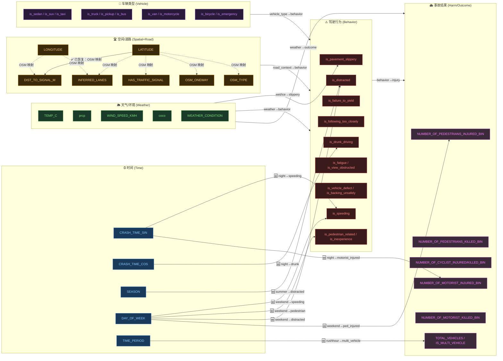

# 因果宏观结构图 v2（约束修订版）

> 生成日期：2026-04-15  
> 对应矩阵：`configs/causal_matrix_v2_constrained.npy`（222 条边）  
> 原始矩阵：`configs/causal_matrix_notears_mlp.npy`（214 条边）  
> 新增 8 条 / 删除 0 条（约束修复后空间→道路边已保留，详见 [tab/causal_macro_edges_v2.md](../tab/causal_macro_edges_v2.md)）

---

## 节点分组说明

| 组别 ID | 名称 | 节点数 | 代表变量 |
|---------|------|--------|---------|
| T | 时间（Time） | 5 | CRASH_TIME_SIN/COS, SEASON, DAY_OF_WEEK, TIME_PERIOD |
| V | 车辆类型（Vehicle） | 10 | is_sedan, is_suv, is_taxi … |
| W | 天气/环境（Weather） | 5 | TEMP_C, prcp, WIND_SPEED_KMH, coco, WEATHER_CONDITION |
| R | 道路属性（Road） | 7 | LATITUDE, LONGITUDE, DIST_TO_SIGNAL_M, INFERRED_LANES … |
| B | 驾驶行为（Behavior） | 12 | is_distracted, is_speeding, is_failure_to_yield … |
| H | 事故结果（Harm/Outcome） | 8 | pedestrian/cyclist/motorist injured/killed bins, TOTAL_VEHICLES, IS_MULTI_VEHICLE |

> **注意**：v2 约束修订中，`LATITUDE`/`LONGITUDE` 被归入"空间（Spatial）"子组，但在 OSM 特征工程语义下它们 *应当* 可以指向道路属性节点（R 组），因为 OSM 属性正是通过空间坐标映射得到的。  
> **已修复（2026-04-15）**：`revise_causal_matrix.py` 约束规则已修正，仅禁止 `time→road`，`spatial→road` 边保留，矩阵重新生成为 222 条边。

---

## Mermaid 宏观因果图

---

## 图例说明

| 线型 | 含义 |
|------|------|
| `-->` 实线（绿色标注 🆕） | v2 新增边 |
| `-.->` 虚线（橙色标注 ⚠️） | v2 中被错误禁止、建议恢复的边 |
| `-->` 实线（无标注） | 原始 NOTEARS 矩阵保留边 |

---

*对应详细边表见 → [tab/causal_macro_edges_v2.md](../tab/causal_macro_edges_v2.md)*  
*对应宏观缩略图见 → [graph/causal_macro_thumb_v2.png](causal_macro_thumb_v2.png)*  
*对应详细节点图见 → [graph/causal_graph_v2_detailed.png](causal_graph_v2_detailed.png)*
